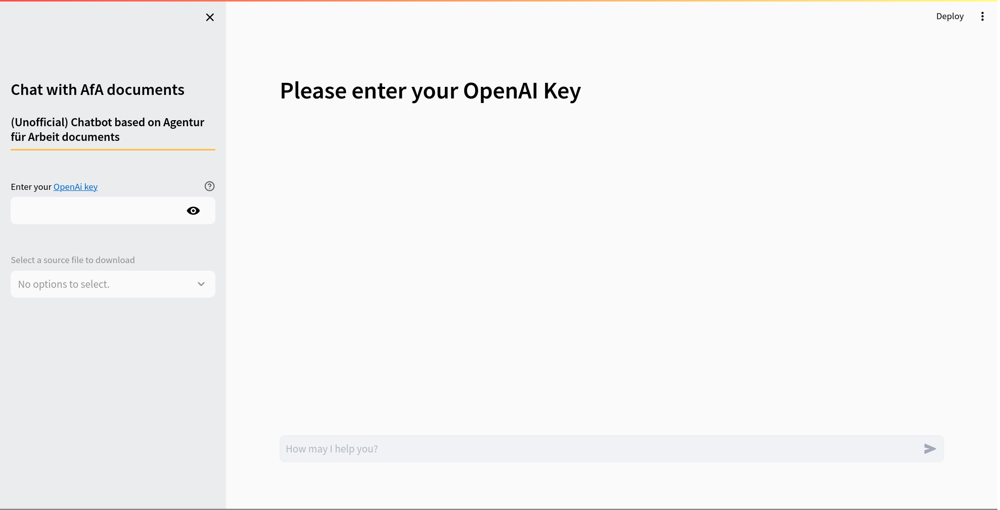

<h1 align="center">Bureau Bot 🤖</h1>


## Bureau Bot

Thank you for your interest in our Chatbot. Please be aware that this is only a Proof of Concept system and may contain bugs or unfinished features.

This chatbot uses documents from the *Agentur für Arbeit* as a data source.
It's important to note that this is a personal project utilizing publicly available documents and is <span style="color:#ad1714;">NOT</span> an official product of the *Agentur für Arbeit*.

Please be aware that the information provided by the chatbot may not always be accurate.
It is advisable to cross-verify any critical information from reliable sources before making any decisions based on the chatbot's response.

Bureau Bot is a document chatbot built using the **Streamlit** framework, the **LlamaIndex** framework, and the **OpenAI API**. Its objective is to help users understand the documents from the *Agentur für Arbeit* by providing them with the information included in the official documents.

<h1 align="center">

</h1>


## Streamlit

You can interact with the Streamlit app [here](https://....). You will need an **OpenAI** key.


## Installation

#### Python version: 3.10.12

1. Clone the repo:

    ```bash
    git clone https://github.com/DanieleDidino/bureaubot.git
    ```

2. Install dependencies:

    ```bash
    pip install -r requirements.txt
    ```
   
3. Run the app in terminal:
   
    ```bash
    streamlit run chatbot_app.py
    ```

The terminal will start a Streamlit web application that you can access in your browser at `http://localhost:8501/`.


## Usage

To use Bureau Bot, you need to enter your OpenAi key.

Bureau Bot will display a chat of all the messages exchanged between the user and the chatbot.

In the Bureau Bot app, you can ask questions about the documents of the *Agentur für Arbeit*.

Bureau Bot will return the pages and the documents used to create a response, you can download these documents by selecting the title of the file you want to download and clicking "*Download*".


## Credits

Bureau Bot was built by [Daniele Didino](www.linkedin.com/in/daniele-didino) and [Marco Zausch](https://www.linkedin.com/in/marcozausch) as a portfolio project for the [Data Science Retreat](https://datascienceretreat.com/) (Berlin). This project was mentored by **Antonio Rueda-Toicen**.
