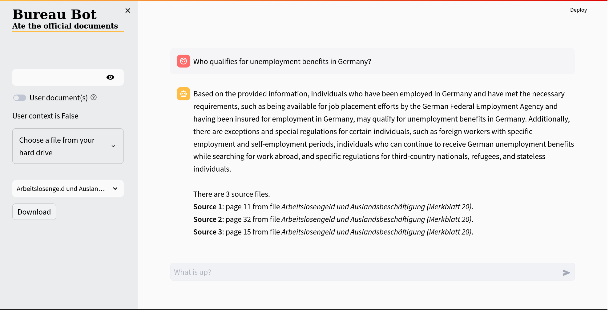

<h1 align="center">Bureau Bot 🤖</h1>


## Bureau Bot

Bureau Bot is a document chatbot built using the **Streamlit** framework, the **LlamaIndex** framework and the **OpenAI API**. Its objective is to help users understand the documents form the *Agentur für Arbeit* by providing them with information included in the official documents.




### Installation


To run Bureau Bot, you need **Python 3.10.12**.

You can install the required packages using the command:

```
 pip install -r requirements.txt
```


### Usage

To use Bureau Bot run in the terminal:

```
 chatbot_app.py
```

It will start a Streamlit web application that you can access in your browser at `http://localhost:8501/`.

To use Bureau Bot, you need to enter your OpenAi key.

Bureau Bot will display a chat all the messages exchanged between the user and the chat bot.


In the Bureau Bot app, you can:
* Ask questions about the documents of the *Agentur für Arbeit*.
* Upload a document (in the formats .docx, .doc, or .pdf) by clicking "*Choose a file from your hard drive*"

Bureau Bot will return the pages and the documents used to create a response, you can download these documents by selecting the title of the file you want to download and clicking "*Download*".

### Credits

Bureau Bot was built by **Daniele Didino** and **Marco Zausch** as a porfolio project for the Data Science Retreat (Berlin). This project was mentored by **Antonio Rueda-Toicen**.
